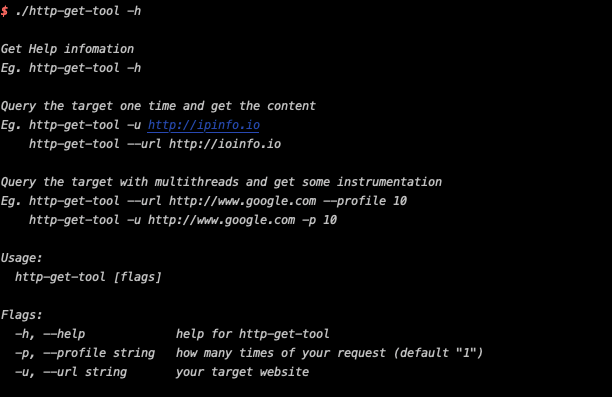
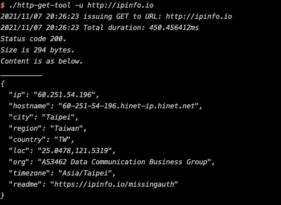
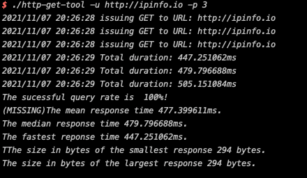

# A instrumatation tool for http request which is running in parallel written by JoeYang

--

### git clone the project then

Build linux version

`cd http-get-tool; env GOOS=linux GOARCH=amd64 go build . `

Build darwain version

`cd http-get-tool; go build . `

Build windows version

`cd http-get-tool; env GOOS=windwos GOARCH=amd64 go build . `

```
./http-get-tool -h

Get Help infomation
Eg. http-get-tool -h

Query the target one time and get the content
Eg. http-get-tool -u http://ipinfo.io
    http-get-tool --url http://ioinfo.io

Query the target with multithreads and get some instrumentation
Eg. http-get-tool --url http://www.google.com --profile 10
    http-get-tool -u http://www.google.com -p 10

Usage:
  http-get-tool [flags]

Flags:
  -h, --help             help for http-get-tool
  -p, --profile string   how many times of your request (default "1")
  -u, --url string       your target website

```



```
./http-get-tool -u http://ipinfo.io

2021/11/07 20:26:23 issuing GET to URL: http://ipinfo.io
2021/11/07 20:26:23 Total duration: 450.456412ms
Status code 200.
Size is 294 bytes.
Content is as below.
__________
{
  "ip": "60.251.54.196",
  "hostname": "60-251-54-196.hinet-ip.hinet.net",
  "city": "Taipei",
  "region": "Taiwan",
  "country": "TW",
  "loc": "25.0478,121.5319",
  "org": "AS3462 Data Communication Business Group",
  "timezone": "Asia/Taipei",
  "readme": "https://ipinfo.io/missingauth"
}
```



```
http-get-tool -u http://ipinfo.io -p 3

2021/11/07 20:26:28 issuing GET to URL: http://ipinfo.io
2021/11/07 20:26:28 issuing GET to URL: http://ipinfo.io
2021/11/07 20:26:28 issuing GET to URL: http://ipinfo.io
2021/11/07 20:26:29 Total duration: 447.251062ms
2021/11/07 20:26:29 Total duration: 479.796688ms
2021/11/07 20:26:29 Total duration: 505.151084ms
The sucessful query rate is  100%!
(MISSING)The mean response time 477.399611ms.
The median response time 479.796688ms.
The fastest reponse time 447.251062ms.
TThe size in bytes of the smallest response 294 bytes.
The size in bytes of the largest response 294 bytes.

```


